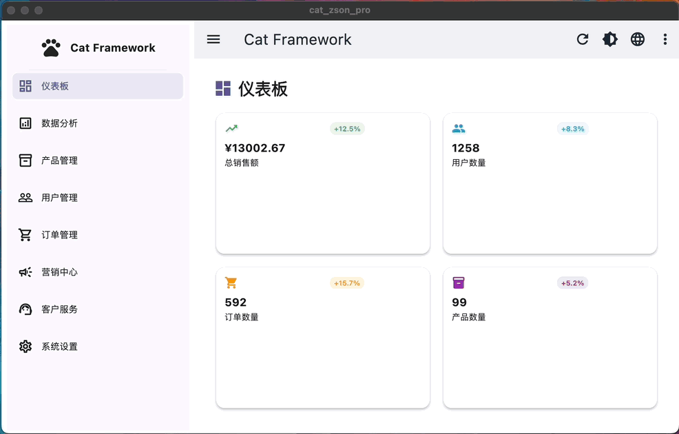

# Cat Framework
[English](README.md) | [中文](README_CN.md)

A comprehensive Flutter scaffolding framework designed to accelerate development with a clean, modular architecture and powerful built-in services.


## 🚀 Features

### Core Framework
- **Modular Architecture**: Clean separation of下` concerns with organized module structure
- **Lifecycle Management**: Built-in page lifecycle handling with caching support
- **Dependency Injection**: Integrated with GetX for efficient service management
- **Responsive Design**: Adaptive UI components for mobile, tablet, and desktop

### Built-in Services

#### 🌐 Network Layer
- **Protocol Adapter**: Type-safe HTTP client with plugin architecture
- **Multiple HTTP Methods**: Support for GET, POST, PUT, DELETE requests
- **Plugin System**: Extensible with logging, caching, retry, and loading plugins
- **Error Handling**: Comprehensive error management with automatic retry logic

#### 💾 Storage System
- **Type-safe Storage**: Generic repositories for different data types
- **Multiple Storage Types**: Single object, list, and key-value storage repositories
- **JSON Serialization**: Automatic serialization/deserialization support
- **Storage Management**: Centralized storage container management

#### 🎨 Theme System
- **Dynamic Theming**: Runtime theme switching support
- **Multiple Themes**: Light, dark, and system-follow modes
- **Customizable**: Easy theme configuration and extension

#### 🌍 Internationalization
- **Multi-language Support**: Built-in i18n with easy language switching
- **Dynamic Translation**: Runtime language changing without restart
- **Extensible**: Simple addition of new languages and translations

#### ⚡ Async Task Management
- **Polling Service**: Background task execution with configurable intervals
- **Retry Logic**: Automatic retry with exponential backoff
- **Task Lifecycle**: Complete task management from creation to completion

#### 📱 UI Components
- **Notification System**: Beautiful, customizable in-app notifications
- **Responsive Navigation**: Adaptive navigation for different screen sizes
- **Page Management**: Advanced page caching and lifecycle management

#### 🔧 Configuration Management
- **Local & Remote Config**: Support for both local and remote configuration
- **Type Safety**: Strongly typed configuration with validation
- **Environment Support**: Multiple environment configurations

#### 📡 Event System
- **Event Bus**: Decoupled communication between modules
- **Type-safe Events**: Strongly typed event system
- **Subscription Management**: Automatic subscription lifecycle management

## 📱 Supported Platforms

- ✅ **Android** - Full support with native optimizations
- ✅ **iOS** - Complete iOS integration
- ✅ **Web** - Progressive web app capabilities
- ✅ **macOS** - Native desktop experience
- ✅ **Windows** - Windows desktop application
- ✅ **Linux** - Linux desktop support

## 🛠 Technology Stack
- **State Management**: GetX 4.7.2
- **Storage**: get_storage 2.1.1
- **Network**: dio 5.7.0, http 1.2.2
- **Responsive UI**: responsive_framework 1.5.1
- **Navigation**: sidebarx 0.17.1
- **Utilities**: intl, uuid, crypto, logger

## 🚀 Quick Start

### Prerequisites
- Flutter SDK 3.27.1 or higher
- Dart SDK 3.0.0 or higher

### Installation

1. **Clone the repository**
```bash
git clone <repository-url>
cd cat-zson-pro
```

2. **Install dependencies**
```bash
flutter pub get
```

3. **Run the application**
```bash
flutter run
```

### Basic Usage

#### 1. Initialize the Framework

```dart
void main() async {
  WidgetsFlutterBinding.ensureInitialized();
  
  // Initialize Cat Framework with plugins
  await CatFramework.instance.initialize(
    config: const CatFrameworkConfig(
      appName: 'My App',
      supportedLocales: [
        Locale('en', 'us'),
        Locale('zh', 'cn'),
      ],
    ),
    networkPlugins: [
      LoggingPlugin(enableDetailLog: true),
      CachePlugin(),
      RetryPlugin(maxRetries: 3),
    ],
  );

  runApp(const MyApp());
}
```

#### 2. Create Your App

```dart
class MyApp extends StatelessWidget {
  @override
  Widget build(BuildContext context) {
    return CatFramework.instance.createApp(
      title: 'My Cat Framework App',
      home: const HomePage(),
      pages: AppPages.routes,
    );
  }
}
```

#### 3. Use Framework Services

```dart
// Network requests
final response = await Cat.network?.request(MyApiRequest());

// Storage operations
final storage = Cat.storage.createListRepository<User>(
  containerName: 'users',
  key: 'user_list',
);

// Event bus
Cat.events.fire(DataRefreshEvent(dataType: 'users'));

// Notifications
Cat.notify.showSuccess(message: 'Operation completed!');

// Theme switching
Cat.theme?.enableDarkMode();

// Language switching
Cat.i18n?.changeLocale('zh', 'cn');
```

## 📁 Project Structure

```
lib/
├── app/
│   ├── core/                 # Core framework components
│   │   ├── framework/        # Main framework classes
│   │   ├── network/          # Network layer & protocol adapter
│   │   ├── storage/          # Storage repositories
│   │   ├── async/            # Async task management
│   │   ├── event/            # Event bus system
│   │   ├── theme/            # Theme management
│   │   ├── i18n/             # Internationalization
│   │   ├── config/           # Configuration management
│   │   └── ui/               # UI services & components
│   ├── modules/              # Feature modules
│   │   ├── home/             # Home module
│   │   ├── auth/             # Authentication module
│   │   ├── navigation/       # Navigation module
│   │   └── settings/         # Settings module
│   ├── routes/               # Route definitions
│   └── utils/                # Utility functions
├── assets/                   # Asset files
└── main.dart                 # Application entry point
```

## 🔧 Configuration

### App Configuration

Create `assets/config/app_config.json`:

```json
{
  "debug": true,
  "appName": "Cat Framework",
  "version": "1.0.0",
  "apiBaseUrl": "https://api.example.com",
  "timeout": 30,
  "environment": "development",
  "features": {
    "enableLogging": true,
    "enableCrashReporting": false,
    "enableAnalytics": false
  },
  "ui": {
    "defaultTheme": "light",
    "animationDuration": 300
  }
}
```

### Framework Configuration

```dart
const config = CatFrameworkConfig(
  appName: 'My App',
  supportedLocales: [
    Locale('en', 'us'),
    Locale('zh', 'cn'),
    Locale('es', 'es'),
  ],
  fallbackLocale: Locale('en', 'us'),
  defaultStorageContainer: 'my_app_storage',
);
```

## 📚 Advanced Usage

### Custom Network Protocols

```dart
class UserListRequest extends IProtocolReq<List<User>> {
  @override
  String get url => '/api/users';
  
  @override
  HttpMethod get method => HttpMethod.get;
  
  @override
  Map<String, dynamic> toJson() => {};
  
  @override
  ApiResponse<List<User>> decode(dynamic data) {
    return ApiResponse.fromJson(
      data,
      (json) => (json as List).map((e) => User.fromJson(e)).toList(),
    );
  }
}
```

### Custom Storage Repositories

```dart
class UserRepository {
  final storage = Cat.storage.createListRepository<User>(
    containerName: 'users',
    key: 'user_data',
  );
  
  List<User> getAllUsers() {
    return storage.readAll(fromJson: User.fromJson);
  }
  
  void saveUser(User user) {
    storage.add(
      item: user,
      toJson: (user) => user.toJson(),
      fromJson: User.fromJson,
    );
  }
}
```

### Custom Events

```dart
class UserLoginEvent extends AppEvent {
  final String userId;
  UserLoginEvent(this.userId) : super('user_login');
}

// Subscribe to events
Cat.events.on<UserLoginEvent>((event) {
  print('User logged in: ${event.userId}');
});

// Fire events
Cat.events.fire(UserLoginEvent('user_123'));
```

## 🧪 Testing

### Running Tests

```bash
# Run all tests
flutter test

# Run tests with coverage
flutter test --coverage

# Run integration tests
flutter drive --target=test_driver/app.dart
```

### Example Test

```dart
import 'package:flutter_test/flutter_test.dart';
import 'package:cat_zson_pro/app/core/framework/cat_framework.dart';

void main() {
  group('Cat Framework Tests', () {
    test('Framework initialization', () async {
      await CatFramework.instance.initialize();
      expect(CatFramework.instance.isInitialized, isTrue);
    });
  });
}
```

## 📦 Building for Production

### Android
```bash
flutter build apk --release
flutter build appbundle --release
```

### iOS
```bash
flutter build ios --release
```

### Web
```bash
flutter build web --release
```

### Desktop
```bash
flutter build windows --release
flutter build macos --release
flutter build linux --release
```

### Development Setup

1. Fork the repository
2. Create a feature branch
3. Make your changes
4. Add tests for your changes
5. Ensure all tests pass
6. Submit a pull request

---

**Made with ❤️ by the Cat Framework Team**
