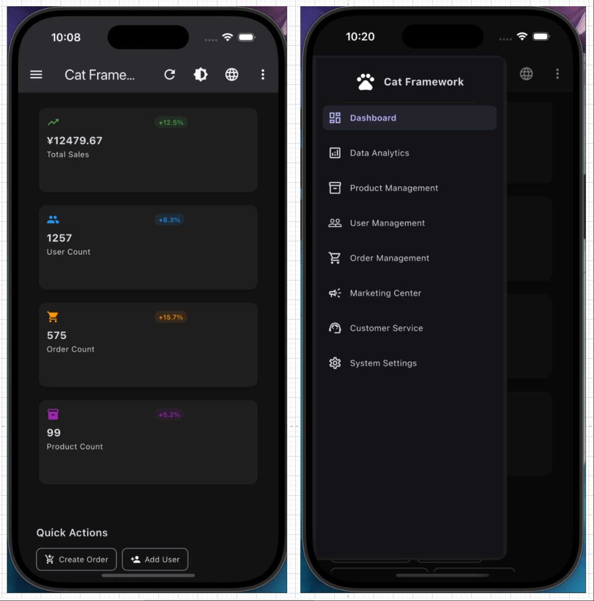

# Cat Framework
[English](README.md) | [中文](README_CN.md)

一个全面的 Flutter 脚手架框架，采用清晰的模块化架构和强大的内置服务，旨在加速开发过程。


## 🚀 特性

### 核心框架
- **模块化架构**：清晰的关注点分离和有组织的模块结构
- **生命周期管理**：内置页面生命周期处理和缓存支持
- **依赖注入**：与 GetX 集成的高效服务管理
- **响应式设计**：适用于移动端、平板和桌面的自适应UI组件

### 内置服务

#### 🌐 网络层
- **协议适配器**：具有插件架构的类型安全HTTP客户端
- **多种HTTP方法**：支持 GET、POST、PUT、DELETE 请求
- **插件系统**：可扩展的日志、缓存、重试和加载插件
- **错误处理**：具有自动重试逻辑的全面错误管理

#### 💾 存储系统
- **类型安全存储**：针对不同数据类型的通用存储库
- **多种存储类型**：单对象、列表和键值对存储库
- **JSON序列化**：自动序列化/反序列化支持
- **存储管理**：集中式存储容器管理

#### 🎨 主题系统
- **动态主题**：运行时主题切换支持
- **多种主题**：亮色、暗色和跟随系统模式
- **可定制**：简单的主题配置和扩展

#### 🌍 国际化
- **多语言支持**：内置国际化和简易语言切换
- **动态翻译**：运行时语言切换无需重启
- **可扩展**：简单添加新语言和翻译

#### ⚡ 异步任务管理
- **轮询服务**：可配置间隔的后台任务执行
- **重试逻辑**：指数退避的自动重试
- **任务生命周期**：从创建到完成的完整任务管理

#### 📱 UI组件
- **通知系统**：美观、可定制的应用内通知
- **响应式导航**：适用于不同屏幕尺寸的自适应导航
- **页面管理**：高级页面缓存和生命周期管理

#### 🔧 配置管理
- **本地和远程配置**：支持本地和远程配置
- **类型安全**：强类型配置和验证
- **环境支持**：多环境配置

#### 📡 事件系统
- **事件总线**：模块间解耦通信
- **类型安全事件**：强类型事件系统
- **订阅管理**：自动订阅生命周期管理

## 📱 支持平台

- ✅ **Android** - 完全支持和原生优化
- ✅ **iOS** - 完整的iOS集成
- ✅ **Web** - 渐进式Web应用程序功能
- ✅ **macOS** - 原生桌面体验
- ✅ **Windows** - Windows桌面应用程序
- ✅ **Linux** - Linux桌面支持

## 🛠 技术栈

- **框架**: Flutter 3.6.0+
- **状态管理**: GetX 4.7.2
- **存储**: get_storage 2.1.1
- **网络**: dio 5.7.0, http 1.2.2
- **响应式UI**: responsive_framework 1.5.1
- **导航**: sidebarx 0.17.1
- **工具**: intl, uuid, crypto, logger

## 🚀 快速开始

### 先决条件
- Flutter SDK 3.6.0 或更高版本
- Dart SDK 3.0.0 或更高版本

### 安装

1. **克隆仓库**
```bash
git clone <repository-url>
cd cat-zson-pro
```

2. **安装依赖**
```bash
flutter pub get
```

3. **运行应用程序**
```bash
flutter run
```

### 基本用法

#### 1. 初始化框架

```dart
void main() async {
  WidgetsFlutterBinding.ensureInitialized();
  
  // 使用插件初始化 Cat Framework
  await CatFramework.instance.initialize(
    config: const CatFrameworkConfig(
      appName: '我的应用',
      supportedLocales: [
        Locale('en', 'us'),
        Locale('zh', 'cn'),
      ],
    ),
    networkPlugins: [
      LoggingPlugin(enableDetailLog: true),
      CachePlugin(),
      RetryPlugin(maxRetries: 3),
    ],
  );

  runApp(const MyApp());
}
```

#### 2. 创建应用

```dart
class MyApp extends StatelessWidget {
  @override
  Widget build(BuildContext context) {
    return CatFramework.instance.createApp(
      title: '我的 Cat Framework 应用',
      home: const HomePage(),
      pages: AppPages.routes,
    );
  }
}
```

#### 3. 使用框架服务

```dart
// 网络请求
final response = await Cat.network?.request(MyApiRequest());

// 存储操作
final storage = Cat.storage.createListRepository<User>(
  containerName: 'users',
  key: 'user_list',
);

// 事件总线
Cat.events.fire(DataRefreshEvent(dataType: 'users'));

// 通知
Cat.notify.showSuccess(message: '操作完成！');

// 主题切换
Cat.theme?.enableDarkMode();

// 语言切换
Cat.i18n?.changeLocale('zh', 'cn');
```

## 📁 项目结构

```
lib/
├── app/
│   ├── core/                 # 核心框架组件
│   │   ├── framework/        # 主要框架类
│   │   ├── network/          # 网络层和协议适配器
│   │   ├── storage/          # 存储库
│   │   ├── async/            # 异步任务管理
│   │   ├── event/            # 事件总线系统
│   │   ├── theme/            # 主题管理
│   │   ├── i18n/             # 国际化
│   │   ├── config/           # 配置管理
│   │   └── ui/               # UI服务和组件
│   ├── modules/              # 功能模块
│   │   ├── home/             # 首页模块
│   │   ├── auth/             # 身份验证模块
│   │   ├── navigation/       # 导航模块
│   │   └── settings/         # 设置模块
│   ├── routes/               # 路由定义
│   └── utils/                # 工具函数
├── assets/                   # 资源文件
└── main.dart                 # 应用程序入口点
```

## 🔧 配置

### 应用配置

创建 `assets/config/app_config.json`：

```json
{
  "debug": true,
  "appName": "Cat Framework",
  "version": "1.0.0",
  "apiBaseUrl": "https://api.example.com",
  "timeout": 30,
  "environment": "development",
  "features": {
    "enableLogging": true,
    "enableCrashReporting": false,
    "enableAnalytics": false
  },
  "ui": {
    "defaultTheme": "light",
    "animationDuration": 300
  }
}
```

### 框架配置

```dart
const config = CatFrameworkConfig(
  appName: '我的应用',
  supportedLocales: [
    Locale('en', 'us'),
    Locale('zh', 'cn'),
    Locale('es', 'es'),
  ],
  fallbackLocale: Locale('en', 'us'),
  defaultStorageContainer: 'my_app_storage',
);
```

## 📚 高级用法

### 自定义网络协议

```dart
class UserListRequest extends IProtocolReq<List<User>> {
  @override
  String get url => '/api/users';
  
  @override
  HttpMethod get method => HttpMethod.get;
  
  @override
  Map<String, dynamic> toJson() => {};
  
  @override
  ApiResponse<List<User>> decode(dynamic data) {
    return ApiResponse.fromJson(
      data,
      (json) => (json as List).map((e) => User.fromJson(e)).toList(),
    );
  }
}
```

### 自定义存储库

```dart
class UserRepository {
  final storage = Cat.storage.createListRepository<User>(
    containerName: 'users',
    key: 'user_data',
  );
  
  List<User> getAllUsers() {
    return storage.readAll(fromJson: User.fromJson);
  }
  
  void saveUser(User user) {
    storage.add(
      item: user,
      toJson: (user) => user.toJson(),
      fromJson: User.fromJson,
    );
  }
}
```

### 自定义事件

```dart
class UserLoginEvent extends AppEvent {
  final String userId;
  UserLoginEvent(this.userId) : super('user_login');
}

// 订阅事件
Cat.events.on<UserLoginEvent>((event) {
  print('用户登录: ${event.userId}');
});

// 触发事件
Cat.events.fire(UserLoginEvent('user_123'));
```

## 🧪 测试

### 运行测试

```bash
# 运行所有测试
flutter test

# 运行带覆盖率的测试
flutter test --coverage

# 运行集成测试
flutter drive --target=test_driver/app.dart
```

### 示例测试

```dart
import 'package:flutter_test/flutter_test.dart';
import 'package:cat_zson_pro/app/core/framework/cat_framework.dart';

void main() {
  group('Cat Framework 测试', () {
    test('框架初始化', () async {
      await CatFramework.instance.initialize();
      expect(CatFramework.instance.isInitialized, isTrue);
    });
  });
}
```

## 📦 生产构建

### Android
```bash
flutter build apk --release
flutter build appbundle --release
```

### iOS
```bash
flutter build ios --release
```

### Web
```bash
flutter build web --release
```

### 桌面端
```bash
flutter build windows --release
flutter build macos --release
flutter build linux --release
```

### 开发设置
1. Fork 仓库
2. 创建功能分支
3. 进行更改
4. 为更改添加测试
5. 确保所有测试通过
6. 提交拉取请求

### 致谢
1. [ResponsiveFramework](https://github.com/Codelessly/ResponsiveFramework)
2. [jonataslaw/getx](https://github.com/Codelessly/ResponsiveFramework)
3. [Frezyx/sidebarx](https://github.com/Frezyx/sidebarx)

**由 Cat Framework 团队用 ❤️ 制作**
